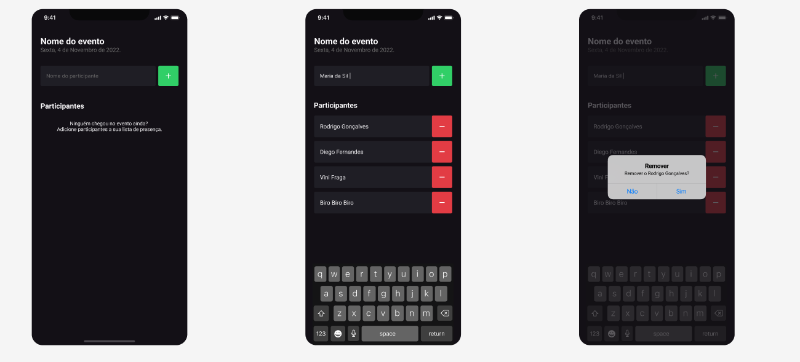

# I'm Here

<div align="center">
	
</div>

## :dart: Objetivo

Projeto de gerenciamento de participantes presentes em um evento desenvolvido com o conteúdo estudado nas aulas do
Chapter I da trilha de React Native do Bootcamp Ignite da Rocketseat.

## :hammer_and_wrench: Ferramentas

- [expo](https://expo.dev/)
- [react-native](https://reactnative.dev/)
- [typescript](https://www.typescriptlang.org/)

## :desktop_computer: Padronização de código

- [Eslint](https://eslint.org/)
- [Prettier](https://prettier.io/)
- [EditorConfig](https://editorconfig.org/)

## :rocket: Executando o projeto

```bash
// Instale as dependências

yarn install

// Concluindo a instalação rode

yarn android
```
